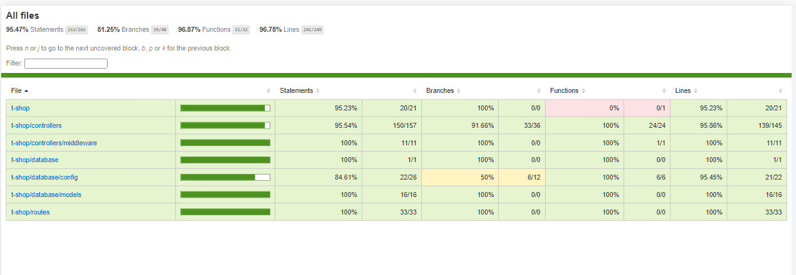

# tshop Backend

Backend Api for a React ecommerce minimum viable product.
Follow this link to see the live version [Tshop](https://idrisscissoko.com/tshop/).

You can also have a look at the [front end code](https://github.com/idriss30/t-shop).

# Prerequisites

- basic knowledge of database creation
- mysql workbench to create or modify database elements

# Technology used

- mysql2
- sequelize
- bcrypt
- express
- jsonwebtoken
- cookie-parser
- stripe
- jest
- supertest

# Key features

- authentication.
- Models creation, querying, and association.
- Payment integration.
- setting up a test environment.
- dealing with shared ressources in a test environment.
- Unit, integration, e2e tests.

# How to use

To clone and run this application, you'll need [Git](https://git-scm.com) and [Node.js](https://nodejs.org/en/download/) (which comes with [npm](http://npmjs.com)) installed on your computer. From your command line:

```bash
# Clone this repository
$ git clone https://github.com/idriss30/tshop-backend.git

# Go into the repository
$ cd tshop-backend

# Install dependencies
$ npm install

# create a development database
$ use mysql workbench or any tool you prefer

# create environment variables
$ create a .env file

# you will need six environment variables
KEY  # which is your stripe key starting with sk
NODE_ENV=production  # for npm script to run a development server
SECRET__JWT # to encode and decode jsonwebtoken for authentication
DATABASE__NAME
DATABASE__USER
DATABASE__PASS  # database password

# Run the app
$ npm run start

# Run the test
$ npm run test

```

# Test Coverage



# Author

Created by me Idris.</br>
You can find me on [LinkedIn](https://www.linkedin.com/in/idrissciss/)

# Support

If you learn anything from this project and/or would like to support:</br>
Please give a star, I would appreciate.</br>
Thanks for your time.
